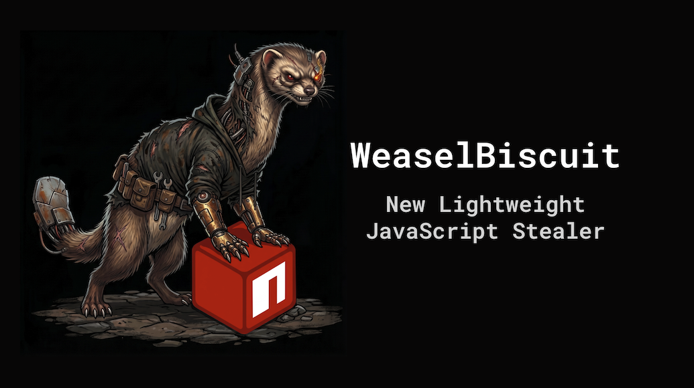
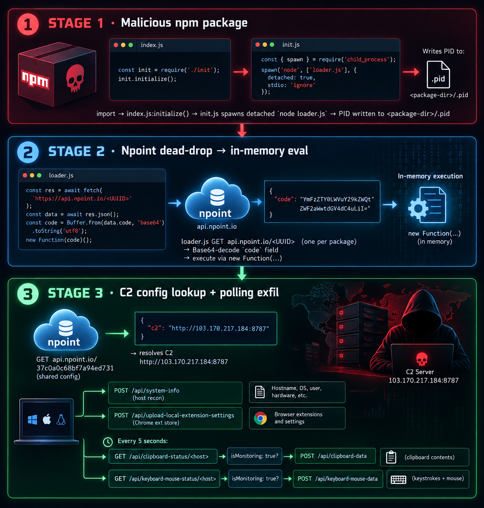

# WeaselBiscuit: Emerging Suspected DPRK-linked Infostealer Assessment



The OpenSourceMalware team spends a lot of time looking at malicious NPM packages, so you end up seeing the same patterns a lot.  So, when you see something new and innovative, it stands out.  That's exactly what happened this week when we found more than a dozen NPM packages that secretly hide a brand new JavaScript stealer.  It looks and feels like the DPRK's Beavertail and OtterCookie, but its different.  It's much smaller and more lightweight as many of the heavier functions have been stripped out.

These are the 16 packages we've found so far:

- laycot 	 		- 2026-09-16T13:51:46Z - version 1.3.10 still available on NPM
- process-mite			- 2026-09-16T23:57:52Z
- @biz44/id10-client 		- 2026-09-12T13:51:46Z
- @biz44/id12-client		- 2026-09-12T13:51:47Z
- @biz44/id44-client		- 2026-09-12T08:03:37Z
- @biz44/id79-client		- 2026-09-12T13:51:48Z
- @biz44/id95-client		- 2026-09-12T13:51:46Z
- @biz44/id99-client		- 2026-09-12T13:51:46Z
- @biz44/process-runtime-utils 	- 2026-09-14T04:41:47Z
- @biz44/runtime-utils		- 2026-09-14T03:39:58Z
- engin1               		- 2026-09-16T03:44:28Z - version 1.3.99 still available on NPM
- id79-client          		- 2026-09-12T13:35:09Z
- process-lhpm         		- 2026-09-15T00:44:34Z
- process-tailwind     		- 2026-09-15T00:20:01Z
- @vibecheck-polid/process-runtime-utils - unknown
- @railone/image-utils		- unknown

## What WeaselBiscuit does

- Executed via NPM `import` — auto-runs a detached background Node process
- Pulls its real payload from an [Npoint](https://www.npoint.io) URL, runs it in memory (never on disk)
- Beacons to a shared HTTP C2 at `103.170.217.184:8787`
- Profiles the host — hostname, user, OS, CPU/RAM, local + public IP, geolocation
- Steals Chrome extension storage on Windows, macOS, Linux (where wallet extensions keep signing state)
- Captures clipboard contents — on operator command
- Logs Windows keystrokes — on operator command
- Tags each install with a numeric campaign ID (`10`, `12`, `44`, `79`, `95`, `99`) for server-side sorting

## What it doesn't do (vs. BeaverTail / OtterCookie)

- No wallet-draining code, no hardcoded wallet extension ID list
- No Chrome-password decryptor, no seed-phrase regex sweep
- No InvisibleFerret / Python second stage
- No screenshot module
- No Socket.IO / WebSocket / remote shell — pure polling HTTP
- No persistence beyond the detached Node process and `.pid` file

## How we found it

Our automation identified these packages as malicious and grouped them together as they shared IOCs.  We quickly identified this as an emerging Node.js infostealer architecture that warrants investigation as a **possible new or lightly documented DPRK-linked strain**, or as a simplified branch/fork of the BeaverTail/OtterCookie ecosystem.

This is an analytic hypothesis, not a confirmed attribution. The recovered code has meaningful overlap with DPRK-associated Contagious Interview tooling, but there is no recovered operator infrastructure, victimology, campaign metadata, signing material, or unique-code comparison sufficient to name a new family or conclusively attribute it to DPRK.

## Why it is notable

The implant combines a package-borne Node.js loader, Npoint dead-drop resolution, Chrome extension-storage theft, clipboard collection, Windows keylogging, and a small custom HTTP control plane. It is operationally simpler than commonly documented OtterCookie deployments:

```text
npm import
  -> detached Node loader
  -> Npoint-delivered JavaScript
  -> Npoint C2 configuration
  -> plain HTTP C2 polling and exfiltration
```

There is no Socket.IO, remote shell, screenshot capability, Python InvisibleFerret handoff, browser-password decryptor, hard-coded wallet list, or server-delivered follow-on payload in the recovered client. The lack of those features may reflect an early-stage build, a reduced operational module, or a distinct actor copying familiar tradecraft.

For readability, this article uses **WeaselBiscuit** as a proposed working name. It is not an established family name.  I made it up and I think its dope. 



## Confirmed infection chain

1. The NPM package is installed
2. An application imports `process-tailwind@1.1.99`.
3. `index.js` automatically calls `initialize()`.
4. `init.js` starts a detached `node loader.js` process and stores its PID in `<package-directory>/.pid`.
5. `loader.js` retrieves JSON from:

   ```text
   https://api.npoint.io/24c25d5f5fcbb0992a4f
   ```

6. The loader Base64-decodes the JSON `code` field and executes it through `new Function`.
7. The retrieved response is an exact match for the supplied second-stage artifact, SHA-256:

   ```text
   7b15605f23b131b3eeea57e031ae7cb32fc4b78c7bbb2025aa7a561ea5ae5159
   ```

8. The second stage obtains the C2 configuration from:

   ```text
   https://api.npoint.io/37c0a0c68bf7a94ed731
   ```

9. The configuration resolves the C2 to:

   ```text
   http://103.170.217.184:8787
   ```

## Campaign structure and identifiers

The recovered package is not an isolated sample. Static analysis and user-authorized inert retrievals identified a cluster of cloned NPM loaders that retrieve near-identical WeaselBiscuit stages from distinct Npoint URLs. The stages differ materially only in a numeric `identifier` field included in system-information and Chrome-extension uploads. This strongly suggests a server-side campaign, tenant, operator, or victim-group label.

| First-stage resolver | Embedded stage identifier | Status |
| --- | ---: | --- |
| `https://api.npoint.io/24c25d5f5fcbb0992a4f` | `99` | Confirmed `process-tailwind` payload. |
| `https://api.npoint.io/641d37178a880b1e8b8f` | `10` | Confirmed `swnwall` payload. |
| `https://api.npoint.io/33e8d008c334b060adad` | `79` | Confirmed WeaselBiscuit clone. |
| `https://api.npoint.io/ddae72efbb6714fae922` | `12` | Confirmed WeaselBiscuit clone. |
| `https://api.npoint.io/933a731a5e97f4b45249` | `95` | Confirmed WeaselBiscuit clone. |
| `https://api.npoint.io/24c12c4b66a29747764f` | Unknown | Hard-coded by `id79-client`; returned HTTP 404 when retrieved. |

All five recovered stages use the same second Npoint configuration resolver, `https://api.npoint.io/37c0a0c68bf7a94ed731`, which supplied the same C2: `http://103.170.217.184:8787`.

The confirmed stage-level identifiers are therefore `10`, `12`, `79`, `95`, and `99`. They should be used as campaign-hunting markers, but their precise meaning is not yet known. The code does not label them as campaign IDs.

### Related NPM packages

| Package | Package label | First-stage resolver |
| --- | --- | --- |
| `process-tailwind@1.1.99` | `ID-99 Client Module` | `24c25d5f5fcbb0992a4f` |
| `engin1@1.3.99` | `ID-99 Client Module` | `24c25d5f5fcbb0992a4f` |
| `swnwall@1.2.10` | `ID-10 Client Module` | `641d37178a880b1e8b8f` |
| `id79-client@1.1.79` | `ID-79 Client Module` | `24c12c4b66a29747764f` |

All four package loaders share the same detached Node process, `.pid` marker, Npoint JSON retrieval, Base64 decoding, and dynamic `new Function` execution template. `process-tailwind` and `engin1` have byte-identical loader, init, and index source files. The `ID-79` label in `id79-client` is consistent with the separate recovered stage carrying `identifier: "79"`, but the package's current resolver response was unavailable, so that direct delivery link is not proven.

## Capabilities

The infostealer uploads the following to the IP-hosted C2:

- Hostname, username, operating-system details, CPU, memory, home/temp paths, local interface IP/MAC addresses, public IP, and public-IP geolocation.
- Every readable, nonempty file under Chrome profiles' `Local Extension Settings` directories on Windows, macOS, and Linux.
- Changed clipboard contents, when the server enables monitoring.
- Windows keyboard events, when the server enables monitoring.

While this malware does not have the same crypto wallet stealer functions as its big siblings, the Chrome extension-storage capability is financially relevant: it can expose wallet-extension state or other extension-held sensitive data. It uploads **every readable, nonempty file** under the extension's `Local Extension Settings` directory — a raw LevelDB key/value store — wholesale. That store legitimately contains a mix of:

- The victim's own account address(es) — typically a small number
- Wallet extensions like MetaMask and their internally cached token/contract address list (used for balance display, price feeds, swap routing)
- Address-book/contact entries (other people's addresses, not the victim's)
- Various other cached metadata

Meanwhile, clipboard and keylogging can capture credentials, API tokens, wallet addresses, or recovery phrases entered or copied during normal use. However, the code does **not** contain direct wallet draining, browser-password decryption, seed-phrase searching, or cryptocurrency transaction functionality.

## C2 design

The C2 is a plain Express HTTP service. Its client-facing interface is small:

| Route | Method | Function |
| --- | --- | --- |
| `/api/system-info` | multipart POST | Host reconnaissance report |
| `/api/upload-local-extension-settings` | multipart POST | Chrome extension storage |
| `/api/clipboard-status/<hostname>` | GET | Clipboard collection switch |
| `/api/clipboard-data` | JSON POST | Clipboard exfiltration |
| `/api/keyboard-mouse-status/<hostname>` | GET | Keylogger switch |
| `/api/keyboard-mouse-data` | JSON POST | Keystroke exfiltration |

The client polls the two status routes every five seconds. Recorded responses for a synthetic host were `200 OK` Express JSON responses with `isMonitoring: false`. No payload, command, redirect, or next-stage URL was observed in those responses.

This differs from documented OtterCookie variants that use Socket.IO and can support broader command execution. It is a polling infostealer control plane, not a full interactive RAT in the recovered code.

## DPRK/BeaverTail/OtterCookie comparison

The overlap supporting the hypothesis is behavioral rather than dispositive:

- Node.js delivery and execution in a developer/package ecosystem.
- Browser extension-storage theft with potential wallet relevance.
- Native clipboard collection using `Get-Clipboard` and `pbpaste`.
- Keylogging, host profiling, and HTTP exfiltration.
- Use of lightweight external configuration to decouple the loader from C2 infrastructure.

The divergences are equally important:

- No Socket.IO, WebSocket, or remote-shell client.
- No screenshots.
- No explicit crypto-wallet extension IDs, browser credential databases, or broad file-targeting rules.
- No InvisibleFerret/Python downloader.
- No observed persistence beyond a detached process and local PID marker.

Cisco Talos has reported that the distinction between BeaverTail and OtterCookie has blurred in recent campaigns, including Node.js keylogging, clipboard monitoring, extension/wallet data targeting, and changing C2 architectures. This makes a lineage relationship plausible but does not prove it. See: [BeaverTail and OtterCookie evolve with a new JavaScript module](https://blog.talosintelligence.com/beavertail-and-ottercookie/).

## BeaverTail vs. OtterCookie vs. WeaselBiscuit — capability comparison

| Capability | BeaverTail | OtterCookie | WeaselBiscuit |
| --- | --- | --- | --- |
| Runtime | JavaScript (also ported to Qt/native) | Node.js | Node.js |
| Delivery | Fake-interview lure + malicious NPM packages | Malicious NPM packages | Malicious NPM packages |
| Staging | Loaded directly by lure package | Loaded directly by lure package | Npoint dead-drop → Base64 → in-memory `new Function` |
| C2 channel | HTTP POST to hardcoded C2 | Socket.IO (bidirectional) | Polling HTTP (Express routes) |
| Host reconnaissance (hostname, user, OS, hardware) | Yes | Yes | Yes |
| Public IP + geolocation (nested `ipify` → `ip-api`) | Yes | Yes | Yes |
| Chrome extension storage theft | Yes | Yes | Yes |
| Hardcoded crypto-wallet extension ID list (MetaMask, Phantom, Coinbase, etc.) | Yes | Yes | **No** |
| Browser credential DB decryption (Chrome Local State, macOS Keychain) | Yes | Partial (variant-dependent) | **No** |
| Seed-phrase / wallet-address regex sweep of local files | Yes | Variant-dependent | **No** |
| File exfiltration (documents, keystores, browser profiles) | Yes | Yes | **No** (extension storage only) |
| Clipboard capture | Variant-dependent | Yes | Yes (operator-gated) |
| Keylogging | Not typical | Yes (recent variants) | Yes, Windows only (operator-gated) |
| Screenshot capture | No | Yes (recent variants) | **No** |
| Remote shell / arbitrary command execution | Via InvisibleFerret handoff | Yes (over Socket.IO) | **No** |
| InvisibleFerret / Python second-stage downloader | Yes | Yes (some variants) | **No** |
| Persistence | LaunchAgent / registry / startup entries | Detached process + variant-specific | Detached Node process + `.pid` marker only |
| Per-install / campaign tagging in code | Not observed publicly | Not observed publicly | Yes — numeric identifier (`10`, `12`, `44`, `79`, `95`, `99`) |

## Confidence and gaps

| Claim | Confidence | Basis / limitation |
| --- | --- | --- |
| Package is a malicious staged Node.js loader | High | Auto-start, detached loader, remote Base64 code execution, and exact recovered payload match. |
| Second stage is an infostealer | High | Static collection and upload logic. |
| `103.170.217.184:8787` is the C2 used by this stage | High | Retrieved configuration and observed client routes. |
| The implementation is a simplified/new branch | Moderate | Distinct architecture and reduced capability set; could also be a commodity copy. |
| Linked to BeaverTail/OtterCookie lineage | Moderate | Npoint dead-drop pattern is near-identical to prior DPRK NPM samples; nested `api.ipify.org` → `ip-api.com` lookup matches DPRK stealer convention; Express polling C2 reads as a lightweight port of OtterCookie's Socket.IO control plane. |
| DPRK attribution | Low to moderate | Consistent DPRK tradecraft signals (Npoint usage, nested public-IP + geolocation, per-install campaign markers), but no exclusive infrastructure or shared code recovered. |
| A wholly new malware family | Low | Requires code-cluster, infrastructure, and victimology comparison. |

### Tradecraft signals worth flagging

- **Npoint.io as the dead-drop.** DPRK NPM crews have been using `api.npoint.io` as a first-stage dead-drop for a long time, and WeaselBiscuit's usage is near-identical to prior DPRK samples: hardcoded UUID, JSON blob containing a Base64 `code` field, in-process `new Function` execution. Same service, same shape, same execution pattern.
- **Nested public-IP + geolocation lookup.** The second stage queries `api.ipify.org` for the public IP, then feeds that IP to `ip-api.com` for geolocation. That two-step nested lookup is the same pattern seen in other DPRK-linked NPM stealers — not a common commodity design.
- **Express HTTP C2 as a lightweight port of OtterCookie's Socket.IO plane.** The C2 architecture is new — plain Express routes, polling-based, no bidirectional socket — but its shape (per-host status endpoints gating live collection, separate exfiltration endpoints for clipboard and keyboard, multipart upload for host recon and extension storage) reads as a stripped-down re-implementation of the same control model OtterCookie runs over Socket.IO.
- **Campaign markers resemble PolinRider.** The numeric per-install identifiers (`10`, `12`, `44`, `79`, `95`, `99`) baked into both package names and stage uploads mirror the campaign-marker convention seen in the PolinRider cluster — the operator is tracking installs at the same granularity, using the same "ID in the package name" pattern.

## Detection engineering 

Typical DPRK killchains are long affairs.  Five to seven stages normally.  This allows DPRK threat actors to iterate continuously at the beginning stages where detection typically happens. At the end of the kill chain there isn't much need to innovate and change things up.  So, this means that DPRK will do everything they can to hide their payloads leading to Beavertail, OtterCookie, etc. 

So far that's not what is happening with WeaselBiscuit.  It has three stages, not seven, and the api.npoint.io endpoint is easily found in the NPM package loader.js file.  I've written three yara rules which you'll find in the [yara directory](https://github.com/OpenSourceMalware/WeaselBiscuit/tree/main/yara) to help you detect and identify these payloads early. However, I anticipate that if DPRK is in fact the author of WeaselBiscuit that this will change.  It makes sense for threat actors to start to obfuscate these first stage loaders better to make it harder for us to detect.

## Recommended investigation priorities

1. Sign up for a free [OpenSourceMalware](https://opensourcemalware.com/auth?redirect=%2F) and scan all software packages for the presence of WeaselBiscuit.
2. If you detect WeaselBiscuit in your software estate, immediate quarantine the host and preserve the NPM tarball, package publication metadata, maintainer account, dependency graph, download history, and source repository references.
3. Search public and internal telemetry for all six Npoint UUIDs, the C2 IP/port, the stage identifiers `10`, `12`, `79`, `95`, and `99`, and the API-route strings.
4. Compare the loader and decoded stage against known BeaverTail/OtterCookie samples for shared functions, comments, string conventions, package names, and C2 patterns.
5. Identify the importing parent application: the package itself has no npm lifecycle hook, so execution requires import or manual start.
6. Review affected endpoints for `.pid`, Node child processes, PowerShell processes, and `%TEMP%\\kb-monitor\\keyboard-monitor-*.ps1`.

## Bottom line

Treat WeaselBiscuit as a critical threat. While it is not as 
